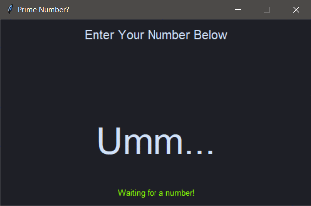

# Prime
A simple application to check if number is prime or not using python Tkinter framework.

### Files:
- **`Prime.py`** : Main file to run, contains all tkinter application layout.
- **`Colors.json`** : Contains themes for the application UI, used inside main file to change theme on keypress events.

### Features :
- Dynamic check, updated result as soon as number typed.
- Warning over non-numeric inputs.
- Results for numbers up to 10 digits long.
- Theme cycles on "*T*" keypress.

### Output Screenshots :

### How to Run :
The application can be launched by running the `Prime.py` python script file via a terminal. Requires Tkinter installed.

> User Can add new themes to the `Colors.json` file. However, application must be restarted to take effect.
