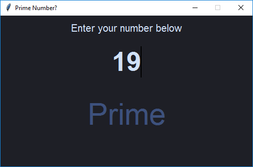

# Prime
A simple tkinter application to check prime numbers.



### Files:
- Colors.py : Contains the set of themes which can be applied in the application. The file is only to store the theme in a dictonary and used in ```Prime.py```
- Prime.py : This is the main file to run. Contains the structure of the application and to check the number.

### Features :
- The number is checked as soon as the user types it.
- Application warns the user on non-digit inputs and removes it automatically from the input.
- Application can give result of number upto 10 digits long after which it does not takes input and warns user.
- The key 'T' on the keyboard can be used to cycle through themes randomly.
